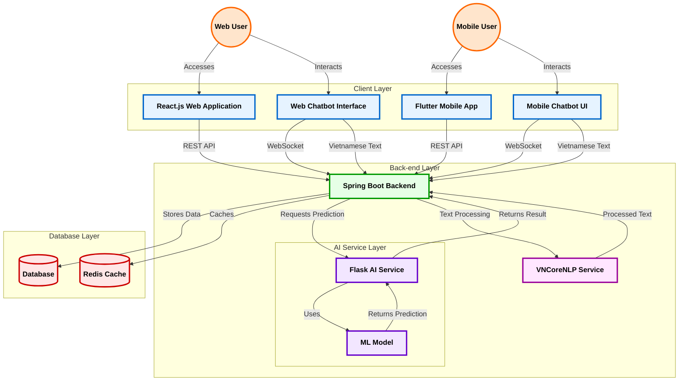

# Health-Connect 🌐


Health-Connect is a modern and intelligent platform for booking medical appointments. It leverages AI-powered chatbot technology to help users quickly identify suitable specialties and seamlessly schedule appointments. This project integrates advanced technologies across the backend and frontend to deliver a user-friendly and efficient healthcare experience.

## Key Features ✨

- 🤖 **AI-Powered Chatbot:** Assists users in determining the right medical specialty based on symptoms.
- 📅 **Seamless Appointment Booking:** Enables users to schedule appointments effortlessly through an intuitive interface.
- 🧠 **Integrated Prediction System:** Utilizes AI to predict potential health issues and suggest relevant specialties.
- 🔒 **Secure Data Handling:** Ensures privacy and security of user data.
- 📱 **Cross-Platform Compatibility:** Accessible from web and mobile devices.

## Tech Stack 🛠️

### Backend

- **Spring Boot**
  - Manages business logic and API endpoints.
  - Receives AI prediction results and processes appointment requests.
- **Flask**
  - Hosts the AI model for disease prediction.
  - Processes user inputs to provide predictions.

### Frontend

- **ReactJS**

  - Delivers a responsive and dynamic user interface.
  - Fetches predictions and booking statuses from Spring Boot APIs.

- **Flutter**
  - Native mobile application for Android and iOS.
  - Implements platform-specific features and optimizations.
  - Material Design 3 components for modern Android UI.

## Architecture Overview 🏗️



1. **User Interaction:** Users interact with the chatbot through the ReactJS and Flutter frontend.
2. **Prediction Request:** The chatbot sends user symptoms to the Flask backend.
3. **AI Prediction:** Flask processes the symptoms and predicts the likely health issue.
4. **API Communication:** Flask sends the prediction to the Spring Boot backend.
5. **Appointment Management:** Spring Boot provides the prediction result to the frontend and handles booking logic.
6. **User Feedback:** The frontend displays the predicted issue and allows users to confirm an appointment.

## Installation and Setup 🚀

### Prerequisites

- Java 17 or higher
- Python 3.9 or higher
- Node.js 16 or higher
- Flutter SDK
- MySQL database

### Backend Setup

#### Spring Boot (Appointment Management)

1. Clone the repository:
   ```bash
   git clone --recurse-submodules https://github.com/Mixture-Tech/Doctor-Appointment.git
   ```
   ```bash
   cd back-end
   ```
2. Configure the `application.properties` file with your database credentials.
3. Build and run the application:
   ```bash
   ./mvnw spring-boot:run
   ```

#### Flask (AI Prediction)

1. Navigate to the AI folder:
   ```bash
   cd predict_disease_base_on_symptoms
   ```
2. Install dependencies:
   ```bash
   pip install -r requirements.txt
   ```
3. Run the Flask server:
   ```bash
   python scripts/predict.py
   ```

### Frontend Setup

1. Clone the repository:
   ```bash
   git clone --recurse-submodules https://github.com/Mixture-Tech/Doctor-Appointment.git
   ```
   ```bash
   cd front-end
   ```
2. Install dependencies:
   ```bash
   npm install
   ```
3. Start the development server:
   ```bash
   npm start
   ```

## Usage 🎯

1. Open the application in your browser.
2. Interact with the chatbot to input your symptoms.
3. View the suggested specialty and confirm your appointment.

## Project Directory Structure 📂

```mermaid
graph TB
    Root[Health-Connect Project]

    Root --> IDE[.idea]
    Root --> VSCode[.vscode]

    Root --> App[app]

    Root --> Assets[assets]
    Assets --> Images[images]

    Root --> Backend[back-end]
    Backend --> SpringBootApp[Spring Boot Application]
    SpringBootApp --> SpringConfig[Configuration]
    SpringBootApp --> SpringControllers[Controllers]
    SpringBootApp --> SpringServices[Services]
    SpringBootApp --> SpringModels[Models]
    SpringBootApp --> SpringRepositories[Repositories]

    Root --> Frontend[front-end]
    Frontend --> ReactApp[React Application]
    ReactApp --> Components[Components]
    ReactApp --> Pages[Pages]
    ReactApp --> Assets[Assets]
    ReactApp --> Services[API Services]

    Root --> AIModule[predict_disease_base_on_symptoms]
    AIModule --> FlaskApp[Flask Application]
    FlaskApp --> MLModels[ML Models]
    FlaskApp --> PredictionAPI[Prediction API]
    FlaskApp --> Utils[Utilities]

    Root --> GitModules[.gitmodules]
    Root --> CodeConduct[CODE_OF_CONDUCT.md]
    Root --> License[LICENSE]

    %% Style Definitions
    classDef default fill:#283446,stroke:#6B8299,stroke-width:2px,color:#fff,font-weight:bold
    classDef folder fill:#1F4068,stroke:#6B8299,stroke-width:2px,color:#fff,font-weight:bold
    classDef file fill:#162B3C,stroke:#6B8299,stroke-width:2px,color:#fff,font-weight:bold
    classDef root fill:#1A365D,stroke:#6B8299,stroke-width:3px,color:#fff,font-weight:bold

    %% Apply styles
    class Root root
    class IDE,VSCode,App,Assets,Backend,Frontend,AIModule folder
    class SpringBootApp,ReactApp,FlaskApp,Components,Pages,Services folder
    class SpringConfig,SpringControllers,SpringServices,SpringModels,SpringRepositories folder
    class MLModels,PredictionAPI,Utils folder
    class GitModules,CodeConduct,License file
```



## Contributing 🤝

We welcome contributions! Please read our [Contributing Guide](./CODE_OF_CONDUCT.md) for more details.

## License 📄

This project is licensed under the MIT License. See the [LICENSE](./LICENSE) file for details.

## Acknowledgments 🙏

- OpenAI for AI model inspiration.
- Spring Boot and Flask communities for backend support.
- ReactJS developers for a smooth frontend experience.

---

Feel free to report issues or suggest improvements in our [GitHub Issues](https://github.com/Mixture-Tech/Doctor-Appointment/issues) section. Together, let's make healthcare more accessible and intelligent!

**Contact:**

- **Email:** vanhoang1231234@gmail.com
- **Website:** [Health-Connect](https://health-connect.com)
